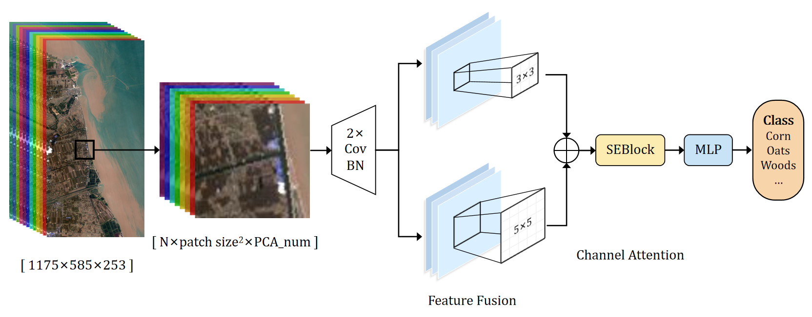

# Land Cover Classification Using Hyperspectral Remote Sensing Images

> This repo is for [The 1st Hyperspectral Remote Sensing Data Processing and Application Competition, CWHEO](https://mp.weixin.qq.com/s?__biz=MzU2MTM4MTYzOQ==&mid=2247556447&idx=1&sn=16036eb3ef166f0e42eab852f6e173fd&chksm=fc7bf537cb0c7c21ddcf8d095cf2e66ff51048325416b7b3ff6a48df5a0aabd1a156cbe09e90&scene=27"赛事信息")

## Introduction

Wetlands are one of the most important ecosystems on Earth, playing an irreplaceable role in maintaining biodiversity, regulating climate, and purifying water. However, due to human activities, global wetland areas are continuously shrinking, and their ecological functions are gradually degrading. To better protect and manage wetlands, there is an urgent need for wetland ecological monitoring and assessment. Hyperspectral remote sensing, with its advantage of nanoscale spectral resolution, provides distinctive information for the fine-scale monitoring of wetland features.

In this repo, we propose a hyperspectral image classification CNN model incorporating Squeeze-and-Excitation Networks (SENet) and multi-scale feature fusion. The model extracts spatial-spectral features through convolutional layers and applies multi-scale fusion using parallel convolutions with different kernel sizes. A SENet block enhances the model by adaptively recalibrating channel-wise features, emphasizing important spectral information. Experimental results show that the model effectively captures spatial and spectral dependencies, improving classification accuracy in hyperspectral imagery.

## Hyper Spectral CNN with Feature Fusion and Atention



## Requirements

see [requirements.txt](requirements.txt)

## Usage

1. `git clone https://github.com/paxtonyu/HSCNN.git`
2. `cd HSCNN`
3. put your dataset in `datasets/`
4. `python main.py --config configs/HSCNN.yaml`

## Group Members

``` none
Group Name: Group of Young Zealots in Spectral Journey, HIAS (GYZSJ, HIAS)
Group Members: Chengyu Pu, Tianyang Shen, Sifang Liang, Yuqing Xue
```
